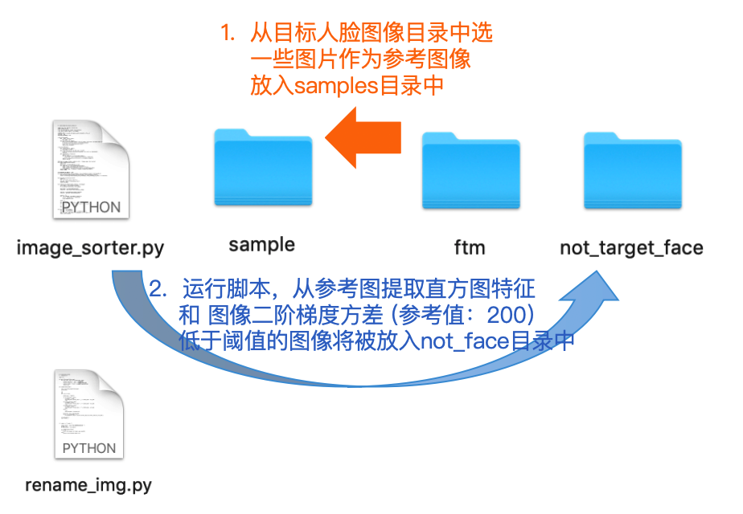

# Image Sorter

Image Sorter OpenCV 图像筛选工具


## Image Sorter 简介

Image Sorter OpenCV 图像筛选（2019.02.01)分为两部分：

### 1.  使用cv2 RGB图像直方图距离
```python
cv2.calcHist([image], [0,1,2], None, bins, [0,256,0,256,0,256])
```

### 2.  使用cv2 拉普拉斯算子计算图像方差 [(图像清晰，高频信号强，方差大)]()

```python
cv2.Laplacian(img_gray, cv2.CV_64F).var()
```


## Image Sorter 项目结构

### 1.  结构简单

 

### 2.  使用方法


```python
python image_sorter.py

输入一张人脸筛选用的人脸参考图片(路径): sample/00401_0.png

输入颜色直方图筛选的源图片目录: sample

输入要测试的人脸图片目录: ftm
```

```python
sample - 参考图像文件目录：放入参考图像

ftm - 待处理的图像文件目录：与参考图像对比,颜色直方图差异过大或图像方差小，图像放入not_target_face目录中
```

```python
python rename_img.py

输入包含待更名图片的目录: ftm
```